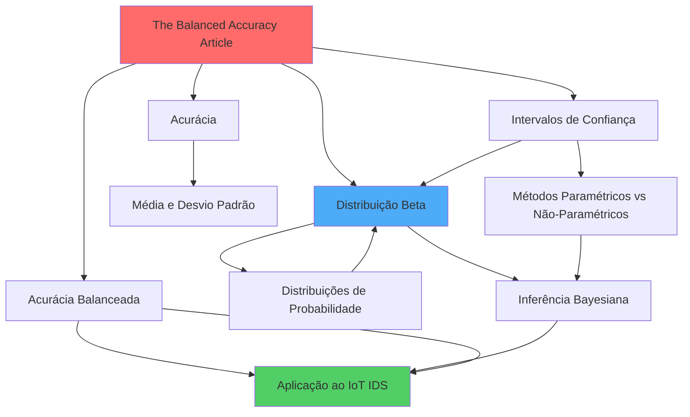

# 🗺️ Mapa de Conhecimento - Avaliação de Modelos de Machine Learning

> **Criado em:** 19 de Outubro de 2025  
> **Contexto:** Pesquisa de Mestrado - Sistema de Detecção de Intrusão para IoT  
> **Dataset:** CICIoT2023

---

## 📚 Artigo Principal

**[[The_Balanced_Accuracy_and_Its_Posterior_Distribution]]**
- Artigo seminal de Brodersen et al. (2010) sobre avaliação de classificadores
- Resolve problemas de datasets desbalanceados e intervalos de confiança inadequados

---

## 🎯 Conceitos Fundamentais

### Métricas de Avaliação
- [[Acurácia]] - Medida básica de desempenho
- [[Acurácia_Balanceada]] - Solução para datasets desbalanceados

### Estatística Descritiva
- [[Média_Desvio_Padrão_Erro_Padrão]] - Medidas de tendência e dispersão
- [[Intervalos_de_Confiança]] - Quantificação de incerteza

---

## 📊 Conceitos Avançados

### Teoria de Probabilidade
- [[Distribuições_de_Probabilidade]] - Modelagem de processos aleatórios
- [[Distribuição_Beta]] - Distribuição específica para proporções

### Abordagens Estatísticas
- [[Métodos_Paramétricos_vs_Não_Paramétricos]] - Filosofias de modelagem
- [[Inferência_Bayesiana]] - Paradigma probabilístico do artigo

---

## 🚀 Aplicações Práticas

- [[Aplicação_ao_IoT_IDS]] - Como aplicar os conceitos ao projeto de mestrado
- [[Exercícios_Práticos]] - Problemas para fixação do conteúdo

---

## 📖 Recursos

- [[Referências_Bibliográficas]] - Livros, artigos e materiais de apoio

---

## 🔗 Relações Entre Conceitos

---

## 🎓 Ordem de Estudo Recomendada

1. Comece por [[Acurácia]] - conceito mais básico
2. Entenda [[Média_Desvio_Padrão_Erro_Padrão]] - fundamentos estatísticos
3. Explore [[Distribuições_de_Probabilidade]] - teoria de probabilidade
4. Aprofunde em [[Distribuição_Beta]] - distribuição específica
5. Compare [[Métodos_Paramétricos_vs_Não_Paramétricos]] - abordagens
6. Mergulhe em [[Inferência_Bayesiana]] - paradigma do artigo
7. Entenda [[Intervalos_de_Confiança]] - quantificação de incerteza
8. Estude [[Acurácia_Balanceada]] - métrica principal
9. Leia [[The_Balanced_Accuracy_and_Its_Posterior_Distribution]] - artigo completo
10. Aplique em [[Aplicação_ao_IoT_IDS]] - seu contexto de pesquisa

---

## 📌 Tags

#machine-learning #statistics #bayesian #evaluation-metrics #IoT #IDS #research #mestrado

