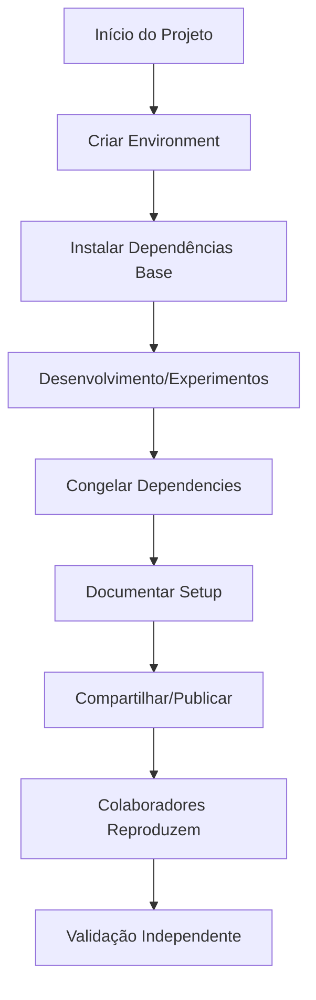

# Lab 01: Configuração de Workspace Python para Pesquisa Acadêmica
## Virtual Environments, Dependency Management e Reprodutibilidade Científica

### 🎯 Objetivos do Laboratório
Ao final deste laboratório, você será capaz de:
- [ ] Compreender a importância de ambientes virtuais em pesquisa acadêmica
- [ ] Criar e gerenciar environments Python profissionalmente
- [ ] Implementar dependency management reproduzível
- [ ] Configurar workflows para colaboração científica
- [ ] Aplicar best practices no seu projeto de mestrado

**Duração Estimada**: 4-6 horas  
**Pré-requisitos**: Python 3.8+ instalado no sistema

---

## 📚 Fundamentos Teóricos

### 1. Por que Virtual Environments são Essenciais?

#### **Problema: "Dependency Hell"**
```python
# Cenário problemático comum
# Projeto A precisa: pandas==1.3.0
# Projeto B precisa: pandas==1.5.0
# Sistema global: Conflito impossível de resolver!
```

#### **Solução: Isolamento de Dependências**
```
Sistema Global
├── Python 3.9
└── pip, setuptools (básicos)

Projeto IoT-IDS
├── venv/ (ambiente isolado)
│   ├── pandas==1.5.3
│   ├── scikit-learn==1.2.2
│   └── mlflow==2.3.1

Projeto Outro
├── venv_outro/ (ambiente isolado)
│   ├── pandas==1.3.0
│   ├── tensorflow==2.8.0
│   └── numpy==1.21.0
```

### 2. Reprodutibilidade Científica

#### **Princípios FAIR para Software**
- **F**indable: Código versionado e acessível
- **A**ccessible: Dependências claras e instaláveis
- **I**nteroperable: Funciona em diferentes sistemas
- **R**eusable: Outros pesquisadores podem reproduzir

#### **Requirements.txt como "Receita de Bolo"**
```txt
# requirements.txt é como uma receita científica
pandas==1.5.3        # Versão EXATA (reprodutibilidade)
numpy>=1.24.0,<1.25  # Range compatível (flexibilidade)
scikit-learn~=1.2.0  # Versão compatível (atualizações seguras)
```

### 3. Ciclo de Vida de um Projeto Acadêmico



---

## 🛠️ Exercícios Práticos

### **Exercício 1: Criando Seu Primeiro Environment**

#### **Passo 1.1: Verificação do Sistema**
```bash
# Abra o terminal e execute:
python --version
# Esperado: Python 3.8+ 

pip --version
# Esperado: pip 20.0+

# Se não tiver Python:
# Ubuntu/Debian: sudo apt install python3 python3-pip
# macOS: brew install python3
# Windows: Download do python.org
```

#### **Passo 1.2: Criando o Environment**
```bash
# Navegue para sua pasta de projetos
cd ~/Desktop  # ou onde preferir

# Crie pasta do projeto
mkdir lab-python-env
cd lab-python-env

# Crie o ambiente virtual
python -m venv lab_env

# Verifique a estrutura criada
ls -la lab_env/
# Esperado: bin/, lib/, include/, pyvenv.cfg
```

#### **Passo 1.3: Ativação e Desativação**
```bash
# ATIVAÇÃO
# Linux/macOS:
source lab_env/bin/activate

# Windows (Command Prompt):
lab_env\Scripts\activate.bat

# Windows (PowerShell):
lab_env\Scripts\Activate.ps1

# Verifique se ativou corretamente
which python
# Esperado: /caminho/para/lab_env/bin/python

# DESATIVAÇÃO (quando necessário)
deactivate
```

**✅ Checkpoint 1**: Seu prompt deve mostrar `(lab_env)` quando ativo.

---

### **Exercício 2: Gerenciamento de Dependências**

#### **Passo 2.1: Instalação Básica**
```bash
# Certifique-se que o environment está ativo
# Prompt deve mostrar: (lab_env)

# Instale alguns pacotes essenciais
pip install pandas
pip install numpy
pip install matplotlib

# Verifique o que foi instalado
pip list
```

#### **Passo 2.2: Criando requirements.txt**
```bash
# Gere o arquivo de dependências
pip freeze > requirements.txt

# Examine o conteúdo
cat requirements.txt
```

**📝 Seu primeiro requirements.txt deve parecer com:**
```txt
contourpy==1.0.7
cycler==0.11.0
fonttools==4.39.3
kiwisolver==1.4.4
matplotlib==3.7.1
numpy==1.24.3
packaging==23.1
pandas==2.0.1
Pillow==9.5.0
pyparsing==3.0.9
python-dateutil==2.8.2
pytz==2023.3
six==1.16.0
tzdata==2023.3
```

#### **Passo 2.3: Testando Reprodutibilidade**
```bash
# Desative o environment atual
deactivate

# Crie um novo environment para teste
python -m venv test_env
source test_env/bin/activate  # Linux/macOS
# ou test_env\Scripts\activate  # Windows

# Instale do requirements.txt
pip install -r requirements.txt

# Verifique se ficou idêntico
pip list
```

**✅ Checkpoint 2**: Os dois environments devem ter exatamente as mesmas versões.

---

### **Exercício 3: Workflow para Pesquisa Acadêmica**

#### **Passo 3.1: Estrutura de Projeto Científico**
```bash
# Desative environment de teste
deactivate

# Volte para o lab principal
cd ~/Desktop/lab-python-env
source lab_env/bin/activate

# Crie estrutura típica de projeto acadêmico
mkdir -p {data,notebooks,src,results,docs}
mkdir -p src/{preprocessing,models,evaluation}

# Estrutura resultante:
tree
```

**Estrutura esperada:**
```
lab-python-env/
├── lab_env/                 # Environment virtual
├── data/                    # Datasets
├── notebooks/               # Jupyter notebooks
├── src/                     # Código fonte
│   ├── preprocessing/       # Scripts de pré-processamento
│   ├── models/             # Implementações de modelos
│   └── evaluation/         # Scripts de avaliação
├── results/                # Resultados experimentais
├── docs/                   # Documentação
└── requirements.txt        # Dependências
```

#### **Passo 3.2: Dependencies para Pesquisa em ML/IoT**
```bash
# Instale stack completo para pesquisa acadêmica
pip install jupyter
pip install scikit-learn
pip install seaborn
pip install plotly
pip install mlflow
pip install pytest

# Atualize requirements.txt
pip freeze > requirements.txt
```

#### **Passo 3.3: Criando Script de Setup Automatizado**
```bash
# Crie script para setup rápido
cat > setup_env.py << 'EOF'
#!/usr/bin/env python3
"""
Setup automatizado para ambiente de pesquisa acadêmica
Uso: python setup_env.py
"""

import subprocess
import sys
import os

def run_command(command):
    """Executa comando e trata erros"""
    try:
        result = subprocess.run(command, shell=True, check=True, 
                              capture_output=True, text=True)
        print(f"✅ {command}")
        return result.stdout
    except subprocess.CalledProcessError as e:
        print(f"❌ Erro: {command}")
        print(f"   {e.stderr}")
        return None

def main():
    print("🔧 Configurando ambiente de pesquisa acadêmica...")
    
    # Verificar se está no environment virtual
    if sys.prefix == sys.base_prefix:
        print("⚠️  WARNING: Não está em ambiente virtual!")
        print("   Execute: source lab_env/bin/activate")
        return
    
    # Instalar dependências
    dependencies = [
        "jupyter", "pandas", "numpy", "scikit-learn",
        "matplotlib", "seaborn", "plotly", "mlflow",
        "pytest", "black", "flake8"
    ]
    
    print("📦 Instalando dependências...")
    for dep in dependencies:
        run_command(f"pip install {dep}")
    
    # Criar requirements.txt
    print("📝 Gerando requirements.txt...")
    run_command("pip freeze > requirements.txt")
    
    # Verificar instalação do Jupyter
    print("🚀 Testando Jupyter...")
    run_command("jupyter --version")
    
    print("\n✨ Setup completo!")
    print("💡 Próximos passos:")
    print("   1. jupyter lab (para iniciar Jupyter)")
    print("   2. python -m pytest (para rodar testes)")
    print("   3. pip install -r requirements.txt (em outros ambientes)")

if __name__ == "__main__":
    main()
EOF

# Torne executável e rode
chmod +x setup_env.py
python setup_env.py
```

**✅ Checkpoint 3**: Script deve executar sem erros e mostrar "Setup completo!".

---

### **Exercício 4: Jupyter Lab para Pesquisa**

#### **Passo 4.1: Configuração do Jupyter**
```bash
# Inicie o Jupyter Lab
jupyter lab

# Deve abrir no navegador: http://localhost:8888
```

#### **Passo 4.2: Notebook de Validação**
No Jupyter, crie um novo notebook chamado `validation.ipynb`:

```python
# Célula 1: Verificação do Environment
import sys
print(f"Python: {sys.version}")
print(f"Executable: {sys.executable}")

# Célula 2: Teste das Bibliotecas Principais
import pandas as pd
import numpy as np
import matplotlib.pyplot as plt
import seaborn as sns
from sklearn.datasets import make_classification

print("✅ Todas as bibliotecas importadas com sucesso!")

# Célula 3: Teste Funcional Simples
# Simular dados IoT para teste
np.random.seed(42)
X, y = make_classification(n_samples=1000, n_features=10, 
                          n_classes=2, random_state=42)

df = pd.DataFrame(X, columns=[f'feature_{i}' for i in range(10)])
df['target'] = y

print(f"Dataset simulado: {df.shape}")
print(f"Distribuição de classes: {df['target'].value_counts()}")

# Célula 4: Visualização Básica
plt.figure(figsize=(12, 4))

plt.subplot(1, 3, 1)
plt.hist(df['feature_0'], bins=30, alpha=0.7)
plt.title('Distribuição Feature 0')

plt.subplot(1, 3, 2)
sns.boxplot(data=df, x='target', y='feature_1')
plt.title('Feature 1 por Classe')

plt.subplot(1, 3, 3)
corr_matrix = df.corr()
sns.heatmap(corr_matrix, cmap='coolwarm', center=0)
plt.title('Matriz de Correlação')

plt.tight_layout()
plt.show()

print("✅ Validação completa do ambiente!")
```

#### **Passo 4.3: Salvamento e Documentação**
```python
# Célula final: Documentação do Environment
import pkg_resources

packages = [d for d in pkg_resources.working_set]
packages_sorted = sorted(packages, key=lambda x: x.project_name.lower())

print("📦 PACKAGES INSTALADOS:")
print("=" * 50)
for package in packages_sorted:
    print(f"{package.project_name}=={package.version}")

# Salve esta lista para comparação futura
with open('../environment_snapshot.txt', 'w') as f:
    f.write("Environment Snapshot\n")
    f.write("=" * 30 + "\n")
    for package in packages_sorted:
        f.write(f"{package.project_name}=={package.version}\n")

print("\n✅ Snapshot salvo em environment_snapshot.txt")
```

**✅ Checkpoint 4**: Notebook deve executar todas as células sem erro.

---

### **Exercício 5: Versionamento e Colaboração**

#### **Passo 5.1: Integração com Git**
```bash
# Volte ao terminal (pode manter Jupyter rodando)
cd ~/Desktop/lab-python-env

# Inicialize repositório Git
git init

# Crie .gitignore apropriado
cat > .gitignore << 'EOF'
# Python
__pycache__/
*.py[cod]
*$py.class
*.so
.Python
env/
venv/
lab_env/
*.egg-info/
dist/
build/

# Jupyter
.ipynb_checkpoints/
*.ipynb

# Data (normalmente são arquivos grandes)
data/*.csv
data/*.json
data/*.parquet

# Results (podem ser regenerados)
results/*.png
results/*.pdf

# OS
.DS_Store
Thumbs.db

# IDE
.vscode/
.idea/
*.swp
*.swo
EOF

# Adicione arquivos essenciais
git add requirements.txt
git add setup_env.py
git add .gitignore
git add notebooks/

# Primeiro commit
git config user.email "seu@email.com"
git config user.name "Seu Nome"
git commit -m "Initial setup: Python environment and basic structure"
```

#### **Passo 5.2: Script de Reprodução**
```bash
# Crie script para outros reproduzirem o ambiente
cat > SETUP_INSTRUCTIONS.md << 'EOF'
# Reprodução do Ambiente de Pesquisa

## Pré-requisitos
- Python 3.8+
- Git

## Setup Rápido

```bash
# 1. Clone o repositório
git clone <seu-repo-url>
cd lab-python-env

# 2. Crie ambiente virtual
python -m venv lab_env

# 3. Ative o ambiente
source lab_env/bin/activate  # Linux/macOS
# ou lab_env\Scripts\activate  # Windows

# 4. Instale dependências
pip install -r requirements.txt

# 5. Valide instalação
python setup_env.py

# 6. Inicie Jupyter
jupyter lab
```

## Estrutura do Projeto
```
├── lab_env/              # Environment virtual (não versionado)
├── data/                 # Datasets (não versionados)
├── notebooks/            # Jupyter notebooks
├── src/                  # Código fonte
├── results/              # Resultados (não versionados)
├── requirements.txt      # Dependências exatas
├── setup_env.py         # Script de setup
└── SETUP_INSTRUCTIONS.md # Este arquivo
```

## Troubleshooting

### Erro: ModuleNotFoundError
- Certifique-se que o ambiente virtual está ativo
- Execute: `pip install -r requirements.txt`

### Jupyter não abre
- Execute: `jupyter --version`
- Se não funcionar: `pip install jupyter`

### Dependências desatualizadas
- Execute: `pip install --upgrade -r requirements.txt`
EOF

git add SETUP_INSTRUCTIONS.md
git commit -m "Add setup instructions for reproducibility"
```

**✅ Checkpoint 5**: Git deve mostrar commits limpos e .gitignore funcionando.

---

## 🧪 Exercício Avançado: Simulando Colaboração

### **Exercício 6: Teste de Reprodutibilidade**

#### **Passo 6.1: Simular Colaborador**
```bash
# Simule que você é um colaborador recebendo o projeto
cd ~/Desktop
mkdir collab-test
cd collab-test

# "Clone" o projeto (simular)
cp -r ../lab-python-env/* .
rm -rf lab_env/  # Colaborador não tem o environment

# Siga as instruções do SETUP_INSTRUCTIONS.md
python -m venv lab_env
source lab_env/bin/activate
pip install -r requirements.txt
```

#### **Passo 6.2: Validação Independente**
```python
# Execute o notebook validation.ipynb novamente
# Deve funcionar identicamente!

# Compare o environment_snapshot.txt
diff environment_snapshot.txt ../lab-python-env/environment_snapshot.txt
# Deve ser idêntico (ou quase)
```

#### **Passo 6.3: Teste de Desenvolvimento**
```bash
# Simule adição de nova dependência
pip install requests
pip install beautifulsoup4

# Atualize requirements
pip freeze > requirements.txt

# Commit da mudança
git add requirements.txt
git commit -m "Add web scraping dependencies"

# Teste que outro colaborador pode reproduzir
deactivate
rm -rf lab_env
python -m venv lab_env
source lab_env/bin/activate
pip install -r requirements.txt
```

**✅ Checkpoint 6**: Ambos os ambientes devem ser funcionalmente idênticos.

---

## 🎯 Aplicação ao Projeto de Mestrado

### **Exercício 7: Setup para IoT-IDS Research**

#### **Passo 7.1: Ambiente Específico da Pesquisa**
```bash
# Volte ao diretório principal
cd ~/Desktop

# Crie o ambiente real do seu mestrado
mkdir iot-ids-research
cd iot-ids-research

# Environment otimizado para ML/IoT
python -m venv iot_env
source iot_env/bin/activate

# Dependencies específicas do cronograma da Fase 1
cat > requirements_base.txt << 'EOF'
# Core Data Science
pandas==1.5.3
numpy==1.24.3
matplotlib==3.7.1
seaborn==0.12.2

# Machine Learning
scikit-learn==1.2.2
imbalanced-learn==0.10.1

# Experiment Tracking
mlflow==2.3.1
wandb==0.15.3

# Online ML (para concept drift)
river==0.15.0

# Jupyter
jupyter==1.0.0
ipywidgets==8.0.6

# Development
pytest==7.3.1
black==23.3.0
flake8==6.0.0

# Data Validation
great-expectations==0.16.4
pandas-profiling==3.6.6
EOF

pip install -r requirements_base.txt
```

#### **Passo 7.2: Estrutura de Projeto Acadêmico**
```bash
# Estrutura baseada no cronograma da Fase 1
mkdir -p {data/{raw,processed,samples},notebooks/{eda,experiments},src/{preprocessing,models,evaluation,utils}}
mkdir -p {results/{figures,metrics,models},docs,tests}

# Crie arquivos base
touch src/__init__.py
touch src/preprocessing/__init__.py
touch src/models/__init__.py
touch src/evaluation/__init__.py
touch src/utils/__init__.py

# Estrutura resultante para pesquisa
tree -I 'iot_env'
```

#### **Passo 7.3: Template de Notebook Científico**
```python
# notebooks/template_experiment.ipynb
"""
Template para experimentos científicos reproduzíveis
Baseado nas best practices para pesquisa acadêmica
"""

# ===== HEADER PADRÃO =====
import os
import sys
import numpy as np
import pandas as pd
import matplotlib.pyplot as plt
import seaborn as sns
from datetime import datetime

# Adicionar src ao path
sys.path.append('../src')

# Configurações para reprodutibilidade
np.random.seed(42)
plt.style.use('seaborn-v0_8')
sns.set_palette("husl")

# Metadata do experimento
EXPERIMENT_NAME = "baseline_anomaly_detection"
EXPERIMENT_DATE = datetime.now().strftime("%Y%m%d_%H%M%S")
DATA_VERSION = "ciciot2023_sample_10pct"

print(f"🔬 EXPERIMENTO: {EXPERIMENT_NAME}")
print(f"📅 DATA: {EXPERIMENT_DATE}")
print(f"📊 DATASET: {DATA_VERSION}")
print("=" * 50)

# ===== CONFIGURAÇÃO MLflow =====
import mlflow
import mlflow.sklearn

mlflow.set_experiment(EXPERIMENT_NAME)

with mlflow.start_run():
    # Log experiment metadata
    mlflow.log_param("data_version", DATA_VERSION)
    mlflow.log_param("experiment_date", EXPERIMENT_DATE)
    
    # Seu código experimental aqui...
    
    print("✅ Experimento configurado com tracking MLflow")
```

#### **Passo 7.4: Scripts de Automação**
```bash
# Script de setup completo para pesquisa
cat > setup_research_env.py << 'EOF'
#!/usr/bin/env python3
"""
Setup automatizado para ambiente de pesquisa IoT-IDS
Compatível com o cronograma da Fase 1
"""

import subprocess
import sys
import os
from pathlib import Path

def setup_mlflow():
    """Configura MLflow para tracking de experimentos"""
    os.makedirs("mlruns", exist_ok=True)
    print("✅ MLflow tracking configurado")

def setup_dvc():
    """Configura DVC para versionamento de dados"""
    subprocess.run(["pip", "install", "dvc[all]"], check=True)
    if not Path(".dvc").exists():
        subprocess.run(["dvc", "init"], check=True)
    print("✅ DVC configurado")

def setup_git():
    """Configura Git com .gitignore apropriado"""
    gitignore_content = """
# Python
__pycache__/
*.pyc
iot_env/

# Data (gerenciado pelo DVC)
data/raw/*
data/processed/*
!data/raw/.gitkeep
!data/processed/.gitkeep

# Results
results/figures/*.png
results/figures/*.pdf
results/models/*.pkl
results/models/*.joblib

# MLflow
mlruns/

# Jupyter
.ipynb_checkpoints/

# IDE
.vscode/
.idea/
"""
    
    with open(".gitignore", "w") as f:
        f.write(gitignore_content)
    
    # Crie arquivos .gitkeep
    for path in ["data/raw", "data/processed", "results/figures", "results/models"]:
        Path(path).mkdir(parents=True, exist_ok=True)
        Path(path / ".gitkeep").touch()
    
    print("✅ Git configurado com .gitignore otimizado")

def main():
    print("🔬 Configurando ambiente de pesquisa IoT-IDS...")
    
    setup_mlflow()
    setup_dvc()
    setup_git()
    
    print("\n🎉 Setup completo!")
    print("📋 Próximos passos:")
    print("1. git init && git add . && git commit -m 'Initial research setup'")
    print("2. mlflow ui (para interface de experimentos)")
    print("3. jupyter lab (para desenvolvimento)")

if __name__ == "__main__":
    main()
EOF

python setup_research_env.py
```

**✅ Checkpoint 7**: Ambiente completo para pesquisa acadêmica configurado.

---

## 📋 Checklist Final de Validação

### **Conhecimentos Teóricos Adquiridos**
- [ ] Compreendo por que virtual environments são essenciais
- [ ] Sei diferenciar requirements.txt fixos vs. flexíveis
- [ ] Entendo o ciclo de vida de um projeto reproduzível
- [ ] Conheço as best practices para pesquisa acadêmica

### **Habilidades Práticas Desenvolvidas**
- [ ] Crio environments virtuais sem dificuldade
- [ ] Gerencio dependências profissionalmente
- [ ] Configuro estruturas de projeto padronizadas
- [ ] Implemento workflows reproduzíveis
- [ ] Integro com Git para versionamento
- [ ] Uso Jupyter Lab eficientemente

### **Aplicação ao Projeto de Mestrado**
- [ ] Ambiente específico para IoT-IDS configurado
- [ ] Estrutura de pastas alinhada com cronograma Fase 1
- [ ] Templates científicos preparados
- [ ] MLflow e DVC integrados
- [ ] Scripts de automação funcionando

### **Reprodutibilidade Validada**
- [ ] Outro computador pode reproduzir o ambiente
- [ ] requirements.txt gera environments idênticos
- [ ] Colaboradores podem seguir SETUP_INSTRUCTIONS.md
- [ ] Notebooks executam sem modificações

---

## 🚀 Próximos Passos

### **Para Seu Projeto de Mestrado**
1. **Aplique imediatamente**: Use o ambiente IoT-IDS criado no Exercício 7
2. **Adapte**: Modifique requirements conforme necessidades específicas
3. **Document**e: Mantenha SETUP_INSTRUCTIONS.md atualizado
4. **Versione**: Commit regular de mudanças em requirements.txt

### **Aprofundamento Recomendado**
1. **Poetry**: Explore gerenciamento avançado de dependências
2. **Docker**: Containerização para máxima reprodutibilidade
3. **Conda**: Alternativa para ambientes científicos complexos
4. **GitHub Actions**: CI/CD para validação automática

### **Recursos para Continuar Aprendendo**
- **Real Python**: Tutoriais avançados sobre packaging
- **PyPA**: Python Packaging Authority guidelines
- **Twelve-Factor App**: Metodologia para aplicações modernas
- **Research Software Engineering**: Best practices acadêmicas

---

## 🎓 Certificação de Conhecimento

**Você completou com sucesso o Lab 01 de Python Workspace Setup!**

**Competências adquiridas:**
- ✅ Configuração profissional de ambientes Python
- ✅ Dependency management reproduzível
- ✅ Estruturação de projetos acadêmicos
- ✅ Integração com ferramentas de pesquisa (MLflow, Jupyter)
- ✅ Workflows colaborativos para ciência reproduzível

**Tempo investido**: ~4-6 horas  
**Nível alcançado**: Avançado  
**Pronto para**: Aplicação no projeto de mestrado e desenvolvimento da Fase 1

**Este laboratório estabelece as fundações técnicas sólidas para todo o seu projeto de pesquisa. O ambiente que você configurou seguindo este lab será a base para os experimentos 1.1 e 1.2 do cronograma da Fase 1!**